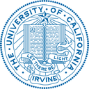

<div align="center">

# SafeDriveVLA: Navigation-Conditioned World Model Dreaming for Conflict-Aware End-to-End Autonomous Driving

<a href="https://daniel-xsy.github.io/">Shaoyuan Xie</a><sup>1,&#42;</sup>&nbsp;&nbsp;
<a href="https://scholar.google.com/citations?user=_vyPx10AAAAJ&hl=en">Zihan Zhang</a><sup>2,&#42;</sup>&nbsp;&nbsp;
<a href="https://openreview.net/profile?id=~Jingxuan_Wang3">Jingxuan Wang</a><sup>3</sup>&nbsp;&nbsp;
<a href="https://scholar.google.com/citations?user=HHcfu5MAAAAJ&hl=en">Jiashu Qu</a><sup>4</sup>&nbsp;&nbsp;
<a href="https://scholar.google.com/citations?user=BpCNwaAAAAAJ&hl=en">Xiaoqing Liang</a><sup>1</sup>
<br>
<a href="https://ldkong.com/">Lingdong Kong</a><sup>5</sup>&nbsp;&nbsp;
<a href="https://openreview.net/profile?id=~Junchi_Lu1">Junchi Lu</a><sup>1</sup>&nbsp;&nbsp;
<a href="https://hichristensen.com/">Henrik I. Christensen</a><sup>2</sup>&nbsp;&nbsp;
<a href="https://www.ics.uci.edu/~alfchen/">Qi Alfred Chen</a><sup>1</sup>

 <sup>1</sup> UC Irvine
&nbsp;&nbsp;·&nbsp;&nbsp;
 <sup>2</sup> UC San Diego
&nbsp;&nbsp;·&nbsp;&nbsp;
 <sup>3</sup> USC
&nbsp;&nbsp;·&nbsp;&nbsp;
 <sup>4</sup> U. Cincinnati
&nbsp;&nbsp;·&nbsp;&nbsp;
 <sup>5</sup> NUS
<br>
<sup>&#42;</sup>Equal contribution

<a href=""></a>
<a href="https://safedrive-vla.github.io/SafeDriveVLA/"></a>
<a href="https://www.corl.org/"></a>
<a href="LICENSE"></a>

</div>

<p align="center">
  
</p>

## About

Vision-Language-Action (VLA) models widen the navigation interface of end-to-end driving from a fixed command set to free-form natural language. This open interface also exposes a new vulnerability surface: a navigation signal can be **unsafe given the current scene**, whether issued by an inattentive driver or on purpose by a malicious user.

We first build a benchmark suite that evaluates driving VLAs along three axes: **navigation following** (CARLA-F), **navigation-scene conflict awareness** (B2D-C and NavSim-C), and **robustness to adversarial instructions** (B2D-Adv). Existing policies fall short on both safe following and conflict awareness.

We then propose **SafeDriveVLA**, which decouples conflict reasoning from action generation:

- **Driving mode.** Every expert frame is relabeled with a discrete driving mode (`<STRICT>`, `<CAUTIOUS>` or `<FALLBACK>`) that states whether the trajectory executes, cautiously follows, or overrides the navigation signal. The model emits this mode token before its actions, so conflict awareness is supervised directly.
- **Navigation-conditioned world model dreaming.** A frozen latent world model (V-JEPA 2 encoder with an action-conditioned predictor) rolls the scene forward under the action anchor of the instructed meta-command. The VLA reads the dreamed world tokens and sees whether the maneuver is feasible before it commits.

## Citation

If you find this work helpful, please consider citing:

```bibtex
@inproceedings{xie2026safedrivevla,
  title     = {SafeDriveVLA: Navigation-Conditioned World Model Dreaming for Conflict-Aware End-to-End Autonomous Driving},
  author    = {Xie, Shaoyuan and Zhang, Zihan and Wang, Jingxuan and Qu, Jiashu and Liang, Xiaoqing and Kong, Lingdong and Lu, Junchi and Christensen, Henrik I. and Chen, Qi Alfred},
  booktitle = {Conference on Robot Learning (CoRL)},
  year      = {2026}
}
```

## Updates

- **[2026.10]** The code of SafeDriveVLA (CoRL 2026) is released: world-model pre-training, VLA training, and closed-loop evaluation on Bench2Drive, CARLA-F, B2D-C and B2D-Adv.

## Outline

- [Installation](#installation)
- [Getting Started](#getting-started)
- [Benchmarks](#benchmarks)
- [Main Results](#main-results)
- [TODO List](#todo-list)
- [License](#license)
- [Acknowledgements](#acknowledgements)

## Installation

Please refer to [install.md](docs/install.md) for the environment setup and data preparation.

## Getting Started

Coming soon, together with the pretrained checkpoints.

## Benchmarks

| Benchmark | Scale | Navigation signal | Evaluates | Metrics |
| :-- | :-: | :-- | :-- | :-- |
| [Bench2Drive](https://github.com/Thinklab-SJTU/Bench2Drive) | 220 routes | command, target waypoint | closed-loop driving | DS, SR, Efficiency, Comfortness |
| **CARLA-F** | 210 routes | command, target waypoint, language | navigation following | NCR per meta-command, Speed Error |
| **B2D-C** | 150 routes | language | navigation-scene conflict | DS, SR, collisions, traffic violations, out-of-route |
| **NavSim-C** | 300 frames | command | navigation-scene conflict (real-world sensors) | PDMS (coming soon) |
| **B2D-Adv** | 15 routes | language | adversarial instructions | DS |

- **CARLA-F** rebuilds each Bench2Drive route on the OpenDRIVE graph so that the ground-truth path performs the sampled meta-command (turn left / right, go straight, lane change left / right, lane follow), with target-speed instructions. Background traffic is disabled and all lights are green, so every navigation signal is safe and should be executed.
- **B2D-C** injects an unsafe natural-language instruction at the safety-critical event of each Bench2Drive scenario; the same instruction would be safe in a different scene.
- **B2D-Adv** extends B2D-C with adversarial instructions that are unsafe under any circumstance.

The route files are in [`benchmark/data`](benchmark/data), the generation toolkit in [`benchmark/generation`](benchmark/generation), and the metrics in [`benchmark/metrics`](benchmark/metrics).

## Main Results

\* trained with the ×0.2 data scale.

<details open>
<summary><b>Bench2Drive</b></summary>

| Method | Nav. | Expert | DS ↑ | SR (%) ↑ | Efficiency ↑ | Comfortness ↑ |
| :-- | :-: | :-: | :-: | :-: | :-: | :-: |
| UniAD | CMD | Think2Drive | 45.81 | 16.36 | 129.21 | 43.58 |
| VAD | CMD | Think2Drive | 42.35 | 15.00 | 157.94 | 46.01 |
| ReCogDrive | CMD | Think2Drive | 71.36 | 45.45 | 138.18 | 17.45 |
| ORION | CMD | Think2Drive | 77.74 | 54.62 | 151.48 | 17.38 |
| MindDrive | CMD | Think2Drive | 78.04 | 55.09 | - | - |
| AutoVLA | Lan | PDM-Lite | 78.84 | 57.73 | 146.93 | 39.33 |
| DriveMoE | WP | Think2Drive | 74.22 | 48.64 | 175.96 | 15.31 |
| SimLingo* | WP | PDM-Lite | 81.48 | 53.66 | 246.01 | 42.33 |
| **SafeDriveVLA\*** | WP | PDM-Lite | **83.64** | **59.82** | **260.67** | **52.48** |

</details>

<details open>
<summary><b>CARLA-F</b> (Navigation Compliance Rate, %)</summary>

| Model | Nav. | Speed Error ↓ | Turn left | Turn right | Go straight | Left lane | Right lane | Lane follow | Avg. ↑ |
| :-- | :-: | :-: | :-: | :-: | :-: | :-: | :-: | :-: | :-: |
| ORION | CMD | - | 100.0 | 100.0 | 94.1 | 60.6 | 58.6 | 86.2 | 87.8 |
| MindDrive | CMD | - | 100.0 | 92.2 | 94.1 | 33.3 | 37.9 | 70.7 | 78.8 |
| AutoMoT | CMD | - | 98.2 | 100.0 | 97.6 | 21.2 | 27.6 | 89.7 | 82.0 |
| SimLingo | Lan | 1.44 | 83.6 | 80.4 | 45.9 | 0.0 | 0.0 | 63.8 | 52.4 |
| SimLingo-IF | Lan | 1.31 | 89.1 | 82.3 | 49.4 | 0.0 | 0.0 | 69.0 | 55.6 |
| SimLingo-Safe | Lan | 1.67 | 92.7 | 84.3 | 50.6 | 0.0 | 0.0 | 62.1 | 55.6 |
| **SafeDriveVLA\*** | Lan | 4.27 | 87.8 | 98.0 | 89.0 | 66.7 | 72.4 | 82.5 | 82.7 |

Avg. is weighted by the number of instructions per meta-command and excludes speed.

</details>

<details open>
<summary><b>B2D-C</b></summary>

| Model | DS ↑ | SR (%) ↑ | Collision ↓ | Traffic Violation ↓ | Out of Route ↓ |
| :-- | :-: | :-: | :-: | :-: | :-: |
| SimLingo | 72.8 | 36.7 | 66 | 60 | 18 |
| SimLingo-IF | 56.3 | 12.7 | 166 | 57 | 32 |
| SimLingo-Safe | 72.8 | 38.0 | 60 | 61 | 11 |
| **SafeDriveVLA\*** | 67.3 | 35.8 | **45** | **9** | **1** |

</details>

<details open>
<summary><b>B2D-Adv</b> (Driving Score on the 15 routes)</summary>

| Model | without attack ↑ | B2D-Adv ↑ |
| :-- | :-: | :-: |
| SimLingo | 71.6 | 43.8 |
| **SafeDriveVLA\*** | **82.8** | **78.4** |

</details>

## TODO List

- [x] World-model pre-training and VLA training code
- [x] Closed-loop evaluation on Bench2Drive, CARLA-F, B2D-C and B2D-Adv
- [x] Benchmark route files and generation toolkit
- [x] Installation and data preparation guide
- [ ] Getting-started guide for training and evaluation
- [ ] Pretrained checkpoints
- [ ] NavSim-C benchmark

## License

This project is released under the [Apache License 2.0](LICENSE). Third-party code keeps its original license:

- `world_model/vjepa2`: V-JEPA 2, MIT ([LICENSE](world_model/vjepa2/LICENSE)).
- `third_party/bench2drive`: the Bench2Drive leaderboard and scenario runner are MIT; other Bench2Drive material is CC BY-NC-ND 4.0 ([LICENSE](third_party/bench2drive/LICENSE)).
- Parts of the data pipeline and the CARLA agent are adapted from SimLingo, Apache-2.0.

## Acknowledgements

This work builds on [SimLingo](https://github.com/RenzKa/simlingo), [Bench2Drive](https://github.com/Thinklab-SJTU/Bench2Drive), [CARLA](https://carla.org/), [V-JEPA 2](https://github.com/facebookresearch/vjepa2), [InternVL](https://github.com/OpenGVLab/InternVL), [AutoVLA](https://github.com/ucla-mobility/AutoVLA), and [LMDrive](https://github.com/opendilab/LMDrive). We thank the authors for releasing their code and data.
